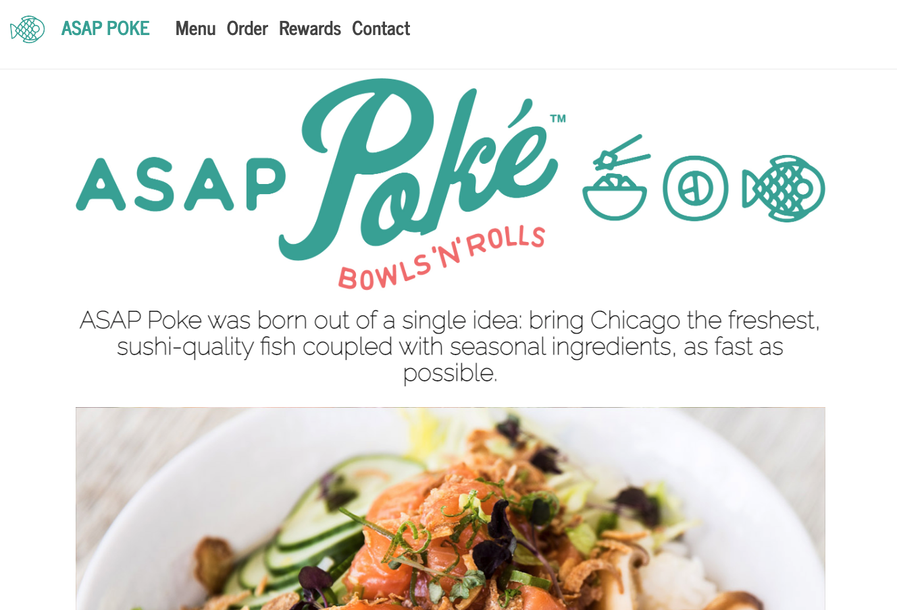
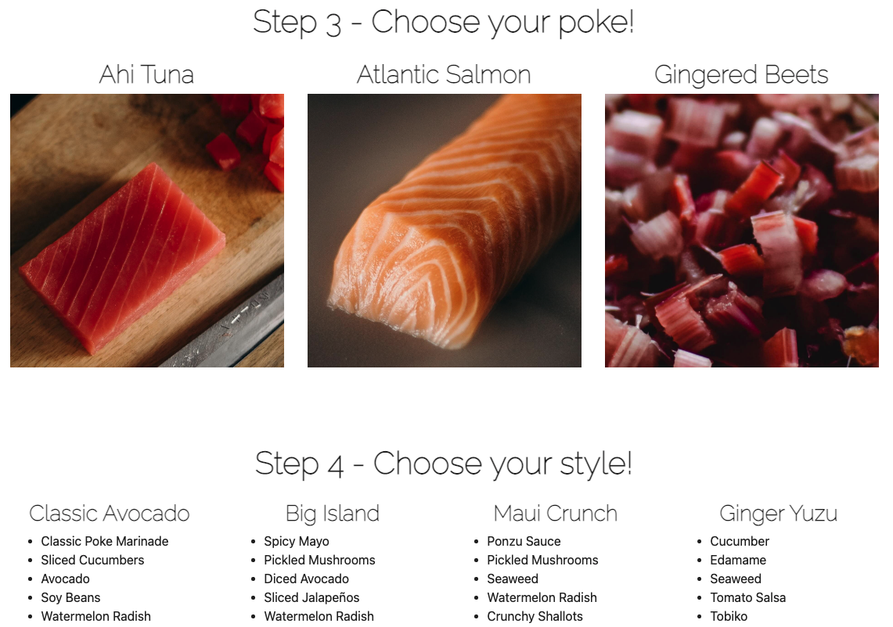
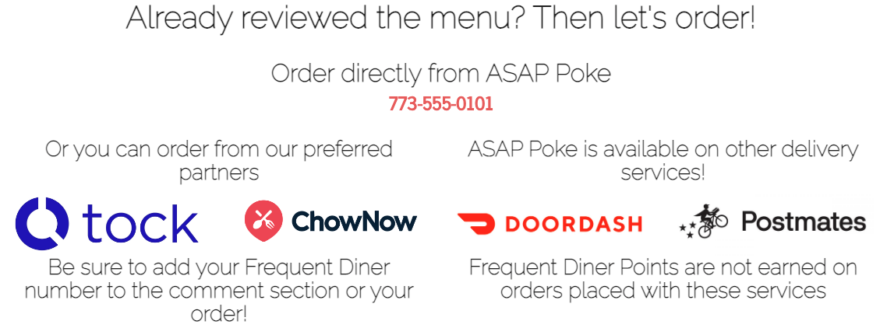
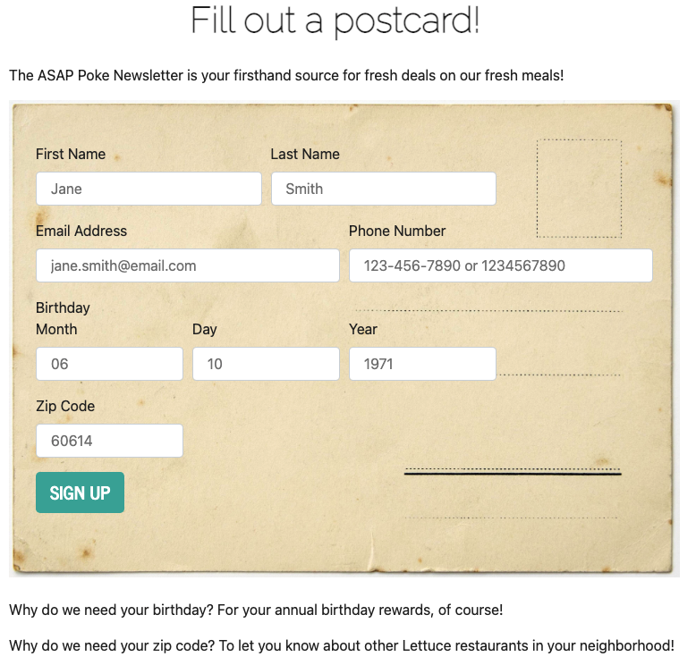

# ASAP Poke

## Deployed Website:
## [https://delicious-dining.herokuapp.com/](https://delicious-dining.herokuapp.com/)

## DESCRIPTION
Brand website for ASAP Poke, a hypothetical restaurant concept. Built with React, deployed on Heroku with the MERN stack, and featuring menu, order, rewards, and newsletter sign-up (which also features form validation).

## SCREENSHOTS

### Homepage

### Menu

### Order

### Rewards

### Contact

## INSTALLATION
- No installation is required, as the user can simply visit the deployed application link: [https://delicious-dining.herokuapp.com/](https://delicious-dining.herokuapp.com/)
- However, if the user wishes to investigate the code locally, the following steps should be performed:
    - Clone the repo for use on your local machine
    - Use the command line to locate the cloned repo and make it your current directory
    - Type `npm install` in the command line; this will install the necessary node module packages and dependencies

## USAGE
- To run the application locally...
    - Use the command line to locate the cloned repo and make it your current directory
    - Simply type `npm start` in the command line
    - This will open a localhost connection on your default browser, wherein the React application will run
- To run the application online, please vist the deployed link:  [https://delicious-dining.herokuapp.com/](https://delicious-dining.herokuapp.com/)
- Happy eating!

## LICENSE
License: MIT License 
[https://opensource.org/licenses/MIT](https://opensource.org/licenses/MIT)

## CONTRIBUTING
Built by yours truly: [https://github.com/JPBrickhouse](https://github.com/JPBrickhouse)
